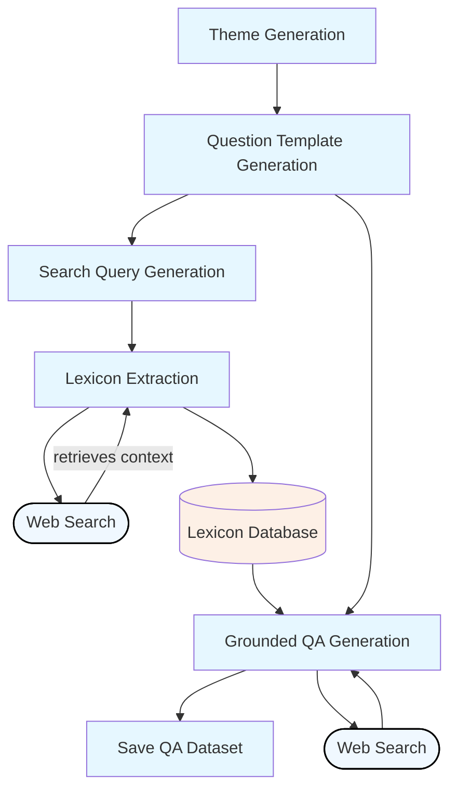

# SUTD QA Chatbot
This project was done as part of SUTD Spring 2025 50.055 MLOps Course.

It explores two methods to generate question-answer pairs for prospective students at SUTD, with the goal of building a chatbot for prospective students to ask questions about SUTD.
The project includes:
1. Question-Answer Pair Generation 
2. Deploying the chatbot via FastAPI and Streamlit

The codebase is organized as:
- `qa_generation/`: contains the code for generating qa pairs
- `data/`: generated qa pairs
- `app/`: interfaces
- `test/`: evaluation scripts

### Question Generation Workflow Diagram
The intended framework to use is Langchain, with our base LLM being Google Gemini 2.0 Flash.




## Question Generation Workflow V1
Core idea: Generate questions with scalability and modularity.

1. **Theme Generation** – Identify key student-centric themes.
2. **Thematic Question Generation** – Generate reusable question templates with placeholders (e.g., `{{CLUB}}`, `{{COURSE}}`).
3. **Lexicon Retrieval** – Use search queries to retrieve real-world lexicon values for each placeholder.
4. **Lexicon Extraction** – Parse retrieved web content to extract relevant lexicon entries.
5. **Question-Answer Generation** – Combine templates and lexicons to generate concrete questions.

### Theme Generation
To generate key themes that students enquire about.

```
You are helping to generate lexicon-rich question templates for prospective students exploring the Singapore University of Technology and Design (SUTD). Generate a JSON object containing 5-8 key themes or points of interest that prospective university students commonly inquire about when considering the SUTD university experience. The keys of the JSON object should be sequential integers starting from 0, and the values should be descriptive strings representing the themes.

You're not limited to these, an example of the desired output format:
{{
  "0": "Interdisciplinary Curriculum",
  "1": "Design-Centric and Hands-On Learning",
  "2": "Campus Culture and Student Life",
  "3": "Graduate Employability and Industry Connections",
  "4": "Pillars and Specialisations",
  "5": "Housing and Campus Facilities",
  "6": "Admissions Criteria, Financial Aid, and Scholarships"
  "7": "Fifth Row (Clubs, Sports, Arts)",
}}

The output should be in a JSON-like format within the curly braces.
    """
```


### Thematic Question Template Generation
To generate template questions with placeholders for given themes.

```
You are helping to generate lexicon-rich question templates for prospective students exploring the Singapore University of Technology and Design (SUTD). Each question should contain a lexicon placeholder (e.g., {{CLUB}}, {{PROGRAM_TYPE}}, {{SEMESTER_YEAR}}) that can later be substituted with concrete values retrieved from the web.

Here are some themes relevant to prospective students, along with sample question templates:

Theme: Student Life and Culture  
{{
  "Social Events": "What kind of social events or traditions does SUTD host during {{SEMESTER_OR_PERIOD}}?",
  "Campus Culture": "What is student culture like for those studying in {{PROGRAM_TYPE}} at SUTD?",
  "Arts and Culture": "What opportunities are there for students interested in {{ARTS_ACTIVITY}} at SUTD?"
}}

Theme: Admissions and Applications  
{{
  "Application Requirements": "What are the application requirements for {{PROGRAM_TYPE}} programs at SUTD?",
  "Essay Guidance": "Do you have any advice for writing the application essay for {{PROGRAM_TYPE}} at SUTD?",
  "Standardized Tests": "What are the policies regarding {{TEST_TYPE}} scores when applying to SUTD?",
  "Application Deadline": "What is the application deadline for entry in {{SEMESTER_YEAR}}?"
}}

Theme: {THEME}
{{
  "{{SUB_THEME_1_KEY}}": "{{SUB_THEME_1_QUERY}}",
  "{{SUB_THEME_2_KEY}}": "{{SUB_THEME_2_QUERY}}",
  "{{SUB_THEME_3_KEY}}": "{{SUB_THEME_3_QUERY}}",
  "{{SUB_THEME_4_KEY}}": "{{SUB_THEME_4_QUERY}}"
}}
Generate 3-5 relevant sub-themes (keys) and corresponding question templates (values) for the theme: {THEME}. Use placeholders like {{COURSE}}, {{FACILITY}}, {{HOSTEL}}, {{CLUB}}, {{SEMESTER_YEAR}}, etc., to keep the questions lexicon-ready. The output should be in a JSON-like format within the curly braces.
"""
```

### Lexicon-based Web Search Query Generation
Given a template question with a given placeholder, generate search queries to retrieve relevant lexicons.

```
You are an expert in generating effective web search queries for finding information related to the Singapore University of Technology and Design (SUTD). Your goal is to create a concise web search query that will retrieve possible values for the lexicon placeholder `{{LEXICON_PLACEHOLDER}}` within the context of SUTD.

Here are a few examples:

**Example 1:**
Question Template: "What does {{CLUB}} do in SUTD?"
LEXICON_PLACEHOLDER: {{CLUB}}
Search Query: {{"search_query": "SUTD student clubs organizations list"}}

**Example 2:**
Question Template: "Who are the professors teaching {{COURSE}} at SUTD?"
LEXICON_PLACEHOLDER: {{COURSE}}
Search Query: {{"search_query": "SUTD course catalog undergraduate graduate"}}

Now, generate a search query for the following:

Question Template: "{QUESTION_TEMPLATE_TO_SEARCH}"
LEXICON_PLACEHOLDER: {LEXICON_PLACEHOLDER_TO_FILL}
Search Query:
```
**Replace the placeholders:**
* `{QUESTION_TEMPLATE_TO_SEARCH}`: Insert the question template you are working with.
* `{LEXICON_PLACEHOLDER_TO_FILL}`: Specify the placeholder you want to fill.

### Lexicon-based Extraction 
Given a search query, do web search to retrieve top-k search results and parse retrieved context.

```
You are an expert in information extraction. Your goal is to parse the provided text and identify specific values that can fill the placeholder `{{LEXICON_PLACEHOLDER}}` in the following question template:

"{{QUESTION_TEMPLATE}}"

The following is the text retrieved from a web search (or other source) that may contain the information you need:

--- START OF CONTEXT ---
{{RETRIEVED_CONTEXT}}
--- END OF CONTEXT ---

Based on this context, please extract all relevant and distinct values that can be used to replace the placeholder `{{LEXICON_PLACEHOLDER}}` in the question template. Return the values as a JSON object where each value is numbered starting from "0". If no relevant values are found in the context, return in JSON format:

Example 1:
Question Template: "What does {{CLUB}} do in SUTD?"
LEXICON_PLACEHOLDER: {{CLUB}}
Retrieved Context: "SUTD offers a wide range of student clubs including the SUTD Robotics Club, SUTD Design Society, SUTD Photography Club, and the SUTD Debate Club..."
Extracted Values:
{{
  "0": "SUTD Robotics Club",
  "1": "SUTD Design Society",
  "2": "SUTD Photography Club",
  "3": "SUTD Debate Club"
}}

Example 2:
Question Template: "Who are the professors teaching {{COURSE}} at SUTD?"
LEXICON_PLACEHOLDER: {{COURSE}}
Retrieved Context: "The undergraduate course catalog lists Introduction to Programming taught by Prof. Lee, and Calculus I taught by Dr. Tan..."
Extracted Values:
{{
  "0": "Introduction to Programming",
  "1": "Calculus I"
}}

Now, apply this to the following:

Question Template: "{QUESTION_TEMPLATE_TO_PARSE}"
LEXICON_PLACEHOLDER: {LEXICON_PLACEHOLDER_TO_EXTRACT}
Retrieved Context:
--- START OF CONTEXT ---
{RETRIEVED_CONTEXT}
--- END OF CONTEXT ---

Extracted Values:
```

**Replace the placeholders:**
* `{QUESTION_TEMPLATE_TO_PARSE}`: Insert the question template you are working with.
* `{LEXICON_PLACEHOLDER_TO_EXTRACT}`: Specify the placeholder you want to fill.
* `{YOUR_RETRIEVED_CONTEXT}`: Paste the text you obtained from your web search (or other information source).

## Question Generation Workflow V2
Since much of knowledge required for qa is available in the web, relying on the pretrained knowledge of the LLM, we can use the same LLM to generate questions directly.

### Direct Question Generation
To generate questions directly, relying on the pretrained knowledge of the LLM.

```
Here are some example questions a prospective student might ask about the **pillars or specializations at the Singapore University of Technology and Design (SUTD)**.  
Please generate a **mix of basic to advanced questions**, and output them as a **JSON array of question strings**.

**Examples:**
{{
    "0": "What pillars are there in SUTD?",
    "1": "How do I choose a pillar, and when do students typically make this decision?",
    "2": "Can I take modules from other pillars even after I choose my specialization?",
    "3": "What kind of projects will I work on in the Engineering Product Development (EPD) pillar?",
    "4": "What career paths do graduates from the Architecture and Sustainable Design (ASD) pillar usually pursue?",
    "5": "How does the Engineering Systems and Design (ESD) pillar differ from industrial engineering in other universities?",
    "6": "What programming languages or tools will I learn in the Computer Science and Design (CSD) pillar?",
    "7": "How is AI integrated into the Design and Artificial Intelligence (DAI) pillar, and are there industry partnerships involved?",
    "8": "Is it possible to switch pillars after I've been allocated one?",
    "9": "Are there any interdisciplinary projects that involve students from multiple pillars?"
}}

Now generate 5-10 new questions in the same JSON format, keeping a healthy mix of beginner and advanced queries.
"""
```

### Thematic Direct Question Generation
Alternatively, we can generate questions with a given theme.

```
Here are some example questions a prospective student might ask about the **{THEME}** at the Singapore University of Technology and Design (SUTD)**.  
Please generate a **mix of basic to advanced questions**, and output them as a **JSON array of question strings**. Please balance some variety in the keywords such as using SUTD's unique naming conventions such as "Fifth Rows" or "Freshmores".

Now generate 5-10 new questions in JSON format.
{{
    "0": "QUESTION_0",
}}
```

## Question-Answer Pair Generation
With the above, we can now generate question-answer pairs.

### Zero-shot Grounded Question-Answer Pair Generation Prompt Template

```
You are a university assistant for Singapore University of Technology and Design (SUTD). Using the question below and a retrieved context, generate a concise and informative answer appropriate for a prospective student to SUTD.

Question: "{QUESTION_STRING}"

Context:
--- START OF CONTEXT ---
{RETRIEVED_CONTEXT}
--- END OF CONTEXT ---

Answer:
```

### Few-shot Grounded Question-Answer Pair Generation Prompt Template
```
You are an expert in information extraction. Your goal is to parse the provided text and identify specific values that can fill the placeholder `{{LEXICON_PLACEHOLDER}}` in the following question template:

"{{QUESTION_TEMPLATE}}"

The following is the text retrieved from a web search (or other source) that may contain the information you need:

--- START OF CONTEXT ---
{{RETRIEVED_CONTEXT}}
--- END OF CONTEXT ---

Based on this context, please extract all relevant and distinct values that can be used to replace the placeholder `{{LEXICON_PLACEHOLDER}}` in the question template. Return the values as a JSON object where each value is numbered starting from "0". If no relevant values are found in the context, return in JSON format:

Example 1:
Question Template: "What does {{CLUB}} do in SUTD?"
LEXICON_PLACEHOLDER: {{CLUB}}
Retrieved Context: "SUTD offers a wide range of student clubs including the SUTD Robotics Club, SUTD Design Society, SUTD Photography Club, and the SUTD Debate Club..."
Extracted Values:
{{
  "0": "SUTD Robotics Club",
  "1": "SUTD Design Society",
  "2": "SUTD Photography Club",
  "3": "SUTD Debate Club"
}}

Example 2:
Question Template: "Who are the professors teaching {{COURSE}} at SUTD?"
LEXICON_PLACEHOLDER: {{COURSE}}
Retrieved Context: "The undergraduate course catalog lists Introduction to Programming taught by Prof. Lee, and Calculus I taught by Dr. Tan..."
Extracted Values:
{{
  "0": "Introduction to Programming",
  "1": "Calculus I"
}}

Now, apply this to the following:

Question Template: "{QUESTION_TEMPLATE_TO_PARSE}"
LEXICON_PLACEHOLDER: {LEXICON_PLACEHOLDER_TO_EXTRACT}
Retrieved Context:
--- START OF CONTEXT ---
{RETRIEVED_CONTEXT}
--- END OF CONTEXT ---

Extracted Values:
```

**Replace the placeholders:**
* `{QUESTION_STRING}`: Insert the question you are working with.

### Few-shot Grounded Question-Answer Pair Generation Prompt Template With Confidence Score
```
You are a university assistant for Singapore University of Technology and Design (SUTD) to answer questions from prospective students about SUTD. Using the question below and a retrieved context, generate a concise and informative answer appropriate for a prospective student to SUTD.

In addition to the answer, output a confidence score from 0 to 1 (as a float) in JSON format. The score should reflect how well the context supports your answer.

Respond in the following JSON format:
{{
  "answer": "<your answer here>",
  "confidence": <float between 0 and 1>
}}

Here is an example:

Question: "What kind of exchange programmes does SUTD offer?"

Context:
--- START OF CONTEXT ---
SUTD offers a range of global exchange programmes including academic exchanges with partner universities in the US, Europe, and Asia. These programmes typically last one term and allow students to take courses overseas while earning credits towards their SUTD degree.
--- END OF CONTEXT ---

Response:
{{
  "answer": "SUTD offers exchange programmes with partner universities in regions like the US, Europe, and Asia. These usually last for one term and allow you to earn credits while studying abroad.",
  "confidence": 0.95
}}

Now, answer the following:

Question: "{QUESTION_STRING}"

Context:
--- START OF CONTEXT ---
{RETRIEVED_CONTEXT}
--- END OF CONTEXT ---

Response:
```

**Replace the placeholders:**
* `{QUESTION_STRING}`: Insert the question you are working with.

## Finetuning
With the QA dataset, we can finetune a pretrained LLM. `unsloth_finetune.py` is an example of finetuning a LoRA adapter for the Llama-3.2-1B model on the SUTD QA dataset.

## LLM Chatbot Web UI
Streamlit for the client interface and FastAPI for the backend server. It supports multiple LLM configurations such as finetuned vs. non-finetuned and RAG-enabled vs. non-RAG modes. The client supports **streamed responses** from the server for a more dynamic chat experience.

---
### 1. Install Dependencies

```bash
pip install -r requirements.txt
```
---

### 2. Start the FastAPI Backend
This server handles requests from the frontend and returns responses.

```bash
fastapi run fastapi_server.py
```

---

### 3. Start the Streamlit Frontend
The frontend connects to the FastAPI server and streams chatbot responses in real-time.

```bash
streamlit run streamlit_webui.py
```

### Architecture Overview

```plaintext
[User]
   ↓
[Streamlit UI]  ⇄  [FastAPI Server]  ⇄  [LLM / RAG Pipeline]
```

- Streamlit handles user input, model selection, and rendering streamed output
- FastAPI provides endpoints for processing input and returning generated text