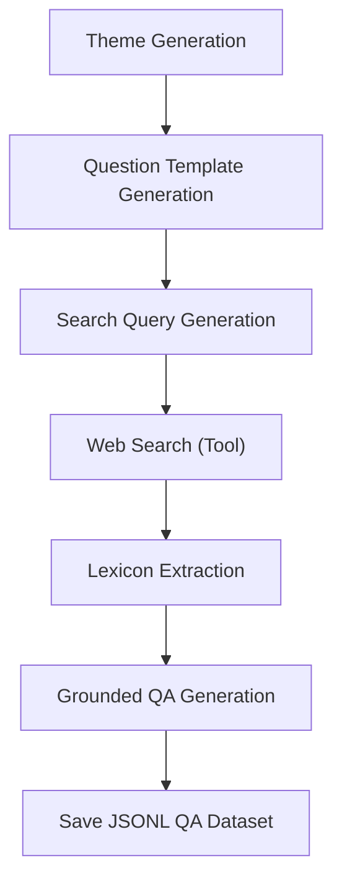

## Question-Answer Pair Generation Workflow

The goal is to generate a dataset of question-answer pairs for prospective students at SUTD.

### One-shot Theme Generation Prompt Template

```
You are helping to generate lexicon-rich question templates for prospective students exploring the Singapore University of Technology and Design (SUTD). Generate a JSON object containing 5-8 key themes or points of interest that prospective university students commonly inquire about when considering the SUTD university experience. The keys of the JSON object should be sequential integers starting from 0, and the values should be descriptive strings representing the themes.

You're not limited to these, an example of the desired output format:
{{
  "0": "Interdisciplinary Curriculum",
  "1": "Design-Centric and Hands-On Learning",
  "2": "Campus Culture and Student Life",
  "3": "Graduate Employability and Industry Connections",
  "4": "Pillars and Specialisations",
  "5": "Housing and Campus Facilities",
  "6": "Admissions Criteria, Financial Aid, and Scholarships"
  "7": "Fifth Row (Clubs, Sports, Arts)",
}}

The output should be in a JSON-like format within the curly braces.
    """
```


### Few-shot Categorical Question Generation Prompt Template
```
You are helping to generate lexicon-rich question templates for prospective students exploring the Singapore University of Technology and Design (SUTD). Each question should contain a lexicon placeholder (e.g., {{CLUB}}, {{PROGRAM_TYPE}}, {{SEMESTER_YEAR}}) that can later be substituted with concrete values retrieved from the web.

Here are some themes relevant to prospective students, along with sample question templates:

Theme: Student Life and Culture  
{{
  "Social Events": "What kind of social events or traditions does SUTD host during {{SEMESTER_OR_PERIOD}}?",
  "Campus Culture": "What is student culture like for those studying in {{PROGRAM_TYPE}} at SUTD?",
  "Arts and Culture": "What opportunities are there for students interested in {{ARTS_ACTIVITY}} at SUTD?"
}}

Theme: Admissions and Applications  
{{
  "Application Requirements": "What are the application requirements for {{PROGRAM_TYPE}} programs at SUTD?",
  "Essay Guidance": "Do you have any advice for writing the application essay for {{PROGRAM_TYPE}} at SUTD?",
  "Standardized Tests": "What are the policies regarding {{TEST_TYPE}} scores when applying to SUTD?",
  "Application Deadline": "What is the application deadline for entry in {{SEMESTER_YEAR}}?"
}}

Theme: {THEME}
{{
  "{{SUB_THEME_1_KEY}}": "{{SUB_THEME_1_QUERY}}",
  "{{SUB_THEME_2_KEY}}": "{{SUB_THEME_2_QUERY}}",
  "{{SUB_THEME_3_KEY}}": "{{SUB_THEME_3_QUERY}}",
  "{{SUB_THEME_4_KEY}}": "{{SUB_THEME_4_QUERY}}"
}}
Generate 3-5 relevant sub-themes (keys) and corresponding question templates (values) for the theme: {THEME}. Use placeholders like {{COURSE}}, {{FACILITY}}, {{HOSTEL}}, {{CLUB}}, {{SEMESTER_YEAR}}, etc., to keep the questions lexicon-ready. The output should be in a JSON-like format within the curly braces.
"""
```

### Few-shot Lexicon-based Web Search Prompt Template

```
You are an expert in generating effective web search queries for finding information related to the Singapore University of Technology and Design (SUTD). Your goal is to create a concise web search query that will retrieve possible values for the lexicon placeholder `{{LEXICON_PLACEHOLDER}}` within the context of SUTD.

Here are a few examples:

**Example 1:**
Question Template: "What does {{CLUB}} do in SUTD?"
LEXICON_PLACEHOLDER: {{CLUB}}
Search Query: {{"search_query": "SUTD student clubs organizations list"}}

**Example 2:**
Question Template: "Who are the professors teaching {{COURSE}} at SUTD?"
LEXICON_PLACEHOLDER: {{COURSE}}
Search Query: {{"search_query": "SUTD course catalog undergraduate graduate"}}

Now, generate a search query for the following:

Question Template: "{QUESTION_TEMPLATE_TO_SEARCH}"
LEXICON_PLACEHOLDER: {LEXICON_PLACEHOLDER_TO_FILL}
Search Query:
```
**Replace the placeholders:**
* `{QUESTION_TEMPLATE_TO_SEARCH}`: Insert the question template you are working with.
* `{LEXICON_PLACEHOLDER_TO_FILL}`: Specify the placeholder you want to fill.

### Few-shot Lexicon Extraction Prompt Template

```
You are an expert in information extraction. Your goal is to parse the provided text and identify specific values that can fill the placeholder `{{LEXICON_PLACEHOLDER}}` in the following question template:

"{{QUESTION_TEMPLATE}}"

The following is the text retrieved from a web search (or other source) that may contain the information you need:

--- START OF CONTEXT ---
{{RETRIEVED_CONTEXT}}
--- END OF CONTEXT ---

Based on this context, please extract all relevant and distinct values that can be used to replace the placeholder `{{LEXICON_PLACEHOLDER}}` in the question template. Return the values as a JSON object where each value is numbered starting from "0". If no relevant values are found in the context, return in JSON format:

Example 1:
Question Template: "What does {{CLUB}} do in SUTD?"
LEXICON_PLACEHOLDER: {{CLUB}}
Retrieved Context: "SUTD offers a wide range of student clubs including the SUTD Robotics Club, SUTD Design Society, SUTD Photography Club, and the SUTD Debate Club..."
Extracted Values:
{{
  "0": "SUTD Robotics Club",
  "1": "SUTD Design Society",
  "2": "SUTD Photography Club",
  "3": "SUTD Debate Club"
}}

Example 2:
Question Template: "Who are the professors teaching {{COURSE}} at SUTD?"
LEXICON_PLACEHOLDER: {{COURSE}}
Retrieved Context: "The undergraduate course catalog lists Introduction to Programming taught by Prof. Lee, and Calculus I taught by Dr. Tan..."
Extracted Values:
{{
  "0": "Introduction to Programming",
  "1": "Calculus I"
}}

Now, apply this to the following:

Question Template: "{QUESTION_TEMPLATE_TO_PARSE}"
LEXICON_PLACEHOLDER: {LEXICON_PLACEHOLDER_TO_EXTRACT}
Retrieved Context:
--- START OF CONTEXT ---
{RETRIEVED_CONTEXT}
--- END OF CONTEXT ---

Extracted Values:
```

**Replace the placeholders:**
* `{QUESTION_TEMPLATE_TO_PARSE}`: Insert the question template you are working with.
* `{LEXICON_PLACEHOLDER_TO_EXTRACT}`: Specify the placeholder you want to fill.
* `{YOUR_RETRIEVED_CONTEXT}`: Paste the text you obtained from your web search (or other information source).


### Zero-shot Grounded Question-Answer Pair Generation Prompt Template

```
You are a university assistant for Singapore University of Technology and Design (SUTD). Using the question below and a retrieved context, generate a concise and informative answer appropriate for a prospective student to SUTD.

Question: "{QUESTION_STRING}"

Context:
--- START OF CONTEXT ---
{RETRIEVED_CONTEXT}
--- END OF CONTEXT ---

Answer:
```

### Few-shot Grounded Question-Answer Pair Generation Prompt Template
```
You are an expert in information extraction. Your goal is to parse the provided text and identify specific values that can fill the placeholder `{{LEXICON_PLACEHOLDER}}` in the following question template:

"{{QUESTION_TEMPLATE}}"

The following is the text retrieved from a web search (or other source) that may contain the information you need:

--- START OF CONTEXT ---
{{RETRIEVED_CONTEXT}}
--- END OF CONTEXT ---

Based on this context, please extract all relevant and distinct values that can be used to replace the placeholder `{{LEXICON_PLACEHOLDER}}` in the question template. Return the values as a JSON object where each value is numbered starting from "0". If no relevant values are found in the context, return in JSON format:

Example 1:
Question Template: "What does {{CLUB}} do in SUTD?"
LEXICON_PLACEHOLDER: {{CLUB}}
Retrieved Context: "SUTD offers a wide range of student clubs including the SUTD Robotics Club, SUTD Design Society, SUTD Photography Club, and the SUTD Debate Club..."
Extracted Values:
{{
  "0": "SUTD Robotics Club",
  "1": "SUTD Design Society",
  "2": "SUTD Photography Club",
  "3": "SUTD Debate Club"
}}

Example 2:
Question Template: "Who are the professors teaching {{COURSE}} at SUTD?"
LEXICON_PLACEHOLDER: {{COURSE}}
Retrieved Context: "The undergraduate course catalog lists Introduction to Programming taught by Prof. Lee, and Calculus I taught by Dr. Tan..."
Extracted Values:
{{
  "0": "Introduction to Programming",
  "1": "Calculus I"
}}

Now, apply this to the following:

Question Template: "{QUESTION_TEMPLATE_TO_PARSE}"
LEXICON_PLACEHOLDER: {LEXICON_PLACEHOLDER_TO_EXTRACT}
Retrieved Context:
--- START OF CONTEXT ---
{RETRIEVED_CONTEXT}
--- END OF CONTEXT ---

Extracted Values:
```

**Replace the placeholders:**
* `{QUESTION_STRING}`: Insert the question you are working with.

### Workflow Diagram
The intended framework to use is Langchain, with our base LLM being Google Gemini 2.0 Flash.


